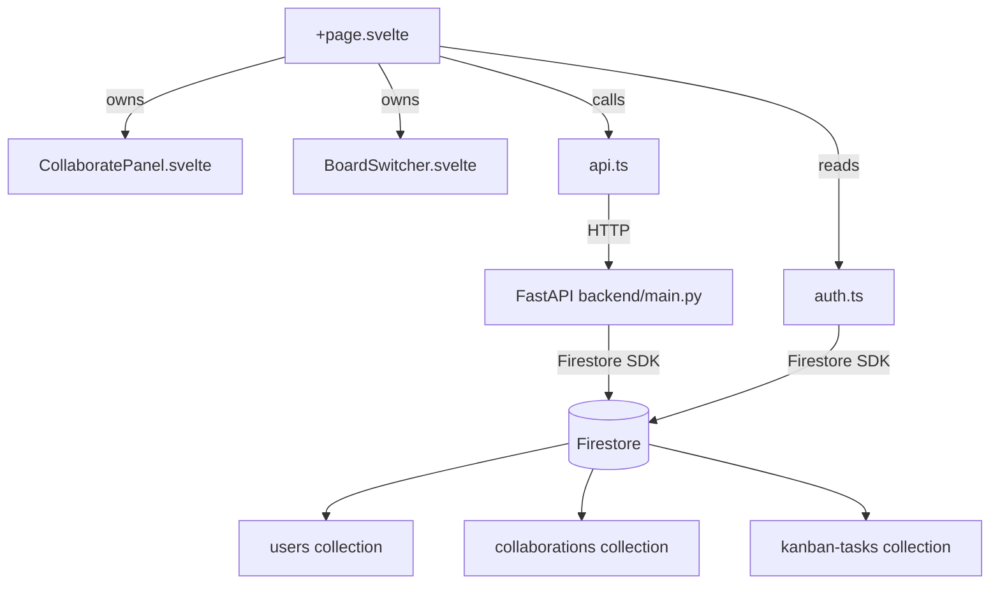

# Design Document: Board Collaboration

## Overview

This feature adds real-time board collaboration to the Kanban application. A board owner can invite other registered users by email. Collaborators can view, add, move, and edit tasks on the owner's board. Each user retains their own personal board. A board switcher lets collaborators toggle between their own board and invited boards. The board header always shows whose board is active.

The feature spans four layers:
- **Firestore** — two new collections (`users`, `collaborations`) plus updated security rules
- **Backend (FastAPI)** — four new collaboration endpoints
- **Frontend lib** — updates to `auth.ts` (user registry write) and `api.ts` (collaboration API calls)
- **Frontend UI** — new `CollaboratePanel.svelte`, new `BoardSwitcher.svelte`, and updates to `+page.svelte`

---

## Architecture



**Data flow for invite:**
1. Owner opens `CollaboratePanel`, types an email, clicks Add
2. Frontend calls `POST /collaborations` with `ownerUserId` + `collaboratorEmail`
3. Backend looks up email in `users` collection, validates, writes to `collaborations`
4. Frontend refreshes the collaborator list in the panel

**Data flow for board switch:**
1. On login, frontend calls `GET /collaborations/invited?collaboratorUid=...`
2. If results exist, `BoardSwitcher` is rendered
3. Selecting a board sets `activeBoardOwnerId`; all task reads/writes use that userId

---

## Components and Interfaces

### CollaboratePanel.svelte

A modal panel rendered inside `+page.svelte`. Visible only when the current user is the board owner.

**Props:**
```typescript
export let ownerUserId: string;
export let currentUserEmail: string;
export let open: boolean = false;
```

**Events:**
```typescript
dispatch('close')
dispatch('collaboratorsChanged', collaborators: Collaborator[])
```

**Internal state:**
- `collaborators: Collaborator[]` — current list fetched from API
- `emailInput: string` — controlled input value
- `errorMsg: string` — validation/API error
- `loading: boolean`

**Behaviour:**
- On mount (when `open` becomes true), fetches collaborators via `GET /collaborations?ownerUserId=...`
- Add button calls `POST /collaborations`; on success pushes to local list
- Remove button calls `DELETE /collaborations/{invite_id}`; on success splices from local list
- Closes on Escape keydown or backdrop click

---

### BoardSwitcher.svelte

A dropdown/select rendered in the board header. Visible only when the user has at least one invited board.

**Props:**
```typescript
export let ownBoard: { userId: string; label: string };
export let invitedBoards: InvitedBoard[];
export let activeUserId: string;
```

**Events:**
```typescript
dispatch('switch', { userId: string; ownerName: string })
```

**Renders:** a `<select>` element listing "My Board" first, then each invited board as "{ownerName}'s Board".

---

### +page.svelte updates

New reactive state:
```typescript
let activeBoardOwnerId: string = currentUser.uid;   // whose tasks to load
let activeBoardOwnerName: string = '';               // for the label
let invitedBoards: InvitedBoard[] = [];
let showCollaboratePanel: boolean = false;
```

**Board identity label logic:**
```typescript
$: boardLabel = activeBoardOwnerId === currentUser?.uid
  ? 'My Board'
  : `${activeBoardOwnerName.split(' ')[0]}'s Board`;
```

**Task operations** use `activeBoardOwnerId` instead of `currentUser.uid` for all API calls when a collaborator is viewing another board.

**Delete button** is hidden when `activeBoardOwnerId !== currentUser.uid`.

---

## Data Models

### Firestore: `users` collection

Document ID = Firebase Auth `uid`.

```typescript
interface UserRecord {
  uid: string;
  email: string;
  displayName: string;
  updatedAt: Timestamp;
}
```

Written by `auth.ts` on every Google sign-in (upsert).

---

### Firestore: `collaborations` collection

Document ID = auto-generated.

```typescript
interface CollaborationInvite {
  id: string;              // document ID
  ownerUserId: string;     // board owner's uid
  collaboratorUid: string; // invited user's uid
  collaboratorEmail: string;
  createdAt: Timestamp;
}
```

---

### Frontend types (api.ts additions)

```typescript
export interface Collaborator {
  id: string;
  collaboratorUid: string;
  collaboratorEmail: string;
}

export interface InvitedBoard {
  inviteId: string;
  ownerUserId: string;
  ownerName: string;
  ownerEmail: string;
}

export interface CollaborationCreate {
  ownerUserId: string;
  collaboratorEmail: string;
}
```

---

### Backend Pydantic models (main.py additions)

```python
class CollaborationCreate(BaseModel):
    ownerUserId: str
    collaboratorEmail: str

class CollaborationRecord(BaseModel):
    id: str
    ownerUserId: str
    collaboratorUid: str
    collaboratorEmail: str
    createdAt: str
```

---

## Correctness Properties

*A property is a characteristic or behavior that should hold true across all valid executions of a system — essentially, a formal statement about what the system should do. Properties serve as the bridge between human-readable specifications and machine-verifiable correctness guarantees.*

### Property 1: Collaborate button visibility is owner-only

*For any* board state and authenticated user, the "Collaborate" button is visible if and only if the active board's owner userId equals the current user's uid.

**Validates: Requirements 1.5**

---

### Property 2: Collaborator panel renders all collaborators with remove buttons

*For any* non-empty list of collaborators returned by the API, the rendered `CollaboratePanel` should display exactly one entry per collaborator, and each entry should contain a "Remove" button.

**Validates: Requirements 1.3, 4.1**

---

### Property 3: Unknown email invite is rejected

*For any* email address that does not exist in the `users` collection, submitting it as an invite should result in an error message being displayed and no new collaborator being added to the list.

**Validates: Requirements 2.3, 7.5**

---

### Property 4: Duplicate email invite is rejected

*For any* email address that is already present in the collaborator list for a given board, submitting it again should result in an error message and the collaborator list length should remain unchanged.

**Validates: Requirements 2.5, 7.6**

---

### Property 5: Valid invite creates a retrievable record

*For any* valid (non-self, non-duplicate, registered) collaborator email, after a successful `POST /collaborations`, a subsequent `GET /collaborations?ownerUserId=...` should include a record with that email.

**Validates: Requirements 2.6, 2.7**

---

### Property 6: User registry upsert is idempotent

*For any* authenticated user who signs in one or more times, the `users` collection should contain exactly one document for that user, and the `displayName` field should reflect the value from the most recent sign-in.

**Validates: Requirements 3.1, 3.2**

---

### Property 7: User registry is queryable by email

*For any* user who has signed in at least once, querying the `users` collection by their email address should return their record.

**Validates: Requirements 3.3**

---

### Property 8: Invite deletion removes access

*For any* collaboration invite, after `DELETE /collaborations/{invite_id}`, a subsequent `GET /collaborations/invited?collaboratorUid=...` should not include the deleted board in the results.

**Validates: Requirements 4.2, 4.3, 4.4**

---

### Property 9: Board switch loads owner's tasks

*For any* invited board selected in the `BoardSwitcher`, all tasks loaded and displayed should have a `userId` equal to the selected board owner's uid, not the collaborator's uid.

**Validates: Requirements 5.3, 5.5**

---

### Property 10: Collaborator cannot delete tasks on foreign boards

*For any* collaborator viewing a board they do not own, the delete button should not be rendered for any task.

**Validates: Requirements 5.6**

---

### Property 11: Board identity label correctness

*For any* authenticated user and any active board, the board label is "My Board" when `activeBoardOwnerId === currentUser.uid`, and "{ownerFirstName}'s Board" otherwise, where `ownerFirstName` is the first space-delimited token of the owner's `displayName`.

**Validates: Requirements 6.1, 6.2**

---

### Property 12: API collaboration round-trip

*For any* valid collaboration invite created via `POST /collaborations`, the record returned by `GET /collaborations?ownerUserId=...` should contain all required fields: `id`, `ownerUserId`, `collaboratorUid`, `collaboratorEmail`, and `createdAt`.

**Validates: Requirements 7.7**

---

## Error Handling

| Scenario | Layer | Handling |
|---|---|---|
| Email not found in User_Registry | Backend | Return HTTP 404 with `{"detail": "User not found"}` |
| Email already a collaborator | Backend | Return HTTP 409 with `{"detail": "Already a collaborator"}` |
| Owner invites themselves | Frontend | Display inline error before API call |
| Empty email input | Frontend | Silently ignore (no error shown) |
| API unreachable during invite | Frontend | Display error message in panel; do not update local list |
| Firebase unavailable on sign-in | Frontend | Log error; user registry write is best-effort (non-blocking) |
| Collaborator tries to delete task | Frontend | Delete button not rendered; no API call possible |
| Invalid `invite_id` on DELETE | Backend | Return HTTP 404 |

---

## Testing Strategy

### Unit Tests

Focus on specific examples, edge cases, and integration points:

- `CollaboratePanel` renders correctly with an empty collaborator list
- `CollaboratePanel` shows error when owner's own email is submitted
- `CollaboratePanel` ignores empty email submission
- `BoardSwitcher` is not rendered when `invitedBoards` is empty
- `boardLabel` returns "My Board" when viewing own board
- `boardLabel` returns "Alice's Board" for a user with displayName "Alice Smith"
- `POST /collaborations` with unknown email returns 404
- `POST /collaborations` with duplicate email returns 409
- `DELETE /collaborations/{id}` with unknown id returns 404

### Property-Based Tests

Use [fast-check](https://github.com/dubzzz/fast-check) for TypeScript frontend tests and [Hypothesis](https://hypothesis.readthedocs.io/) for Python backend tests. Each property test should run a minimum of **100 iterations**.

Each test must be tagged with a comment in the format:
`// Feature: board-collaboration, Property N: <property_text>`

**Frontend (fast-check):**

- **Property 1** — Generate arbitrary `activeBoardOwnerId` and `currentUser.uid` values; assert button visibility matches the equality check.
  `// Feature: board-collaboration, Property 1: Collaborate button visibility is owner-only`

- **Property 2** — Generate arbitrary arrays of `Collaborator` objects; render `CollaboratePanel` and assert entry count and remove button presence.
  `// Feature: board-collaboration, Property 2: Collaborator panel renders all collaborators with remove buttons`

- **Property 10** — Generate arbitrary task lists; render board with `activeBoardOwnerId !== currentUser.uid`; assert no delete buttons are present.
  `// Feature: board-collaboration, Property 10: Collaborator cannot delete tasks on foreign boards`

- **Property 11** — Generate arbitrary `displayName` strings and board ownership states; assert label matches expected format.
  `// Feature: board-collaboration, Property 11: Board identity label correctness`

**Backend (Hypothesis):**

- **Property 3** — Generate arbitrary email strings not present in the mocked `users` collection; assert `POST /collaborations` returns 404.
  `# Feature: board-collaboration, Property 3: Unknown email invite is rejected`

- **Property 4** — Generate a valid collaborator, add them, then attempt to add again; assert 409.
  `# Feature: board-collaboration, Property 4: Duplicate email invite is rejected`

- **Property 5** — Generate valid invite data; POST then GET; assert the record appears with the correct email.
  `# Feature: board-collaboration, Property 5: Valid invite creates a retrievable record`

- **Property 8** — Generate a valid invite, POST it, DELETE it, then GET invited boards; assert the board is absent.
  `# Feature: board-collaboration, Property 8: Invite deletion removes access`

- **Property 9** — Generate a board switch event with a random `ownerUserId`; assert all returned tasks have `userId == ownerUserId`.
  `# Feature: board-collaboration, Property 9: Board switch loads owner's tasks`

- **Property 12** — Generate valid invite payloads; POST and GET; assert all required fields are present in the response.
  `# Feature: board-collaboration, Property 12: API collaboration round-trip`
