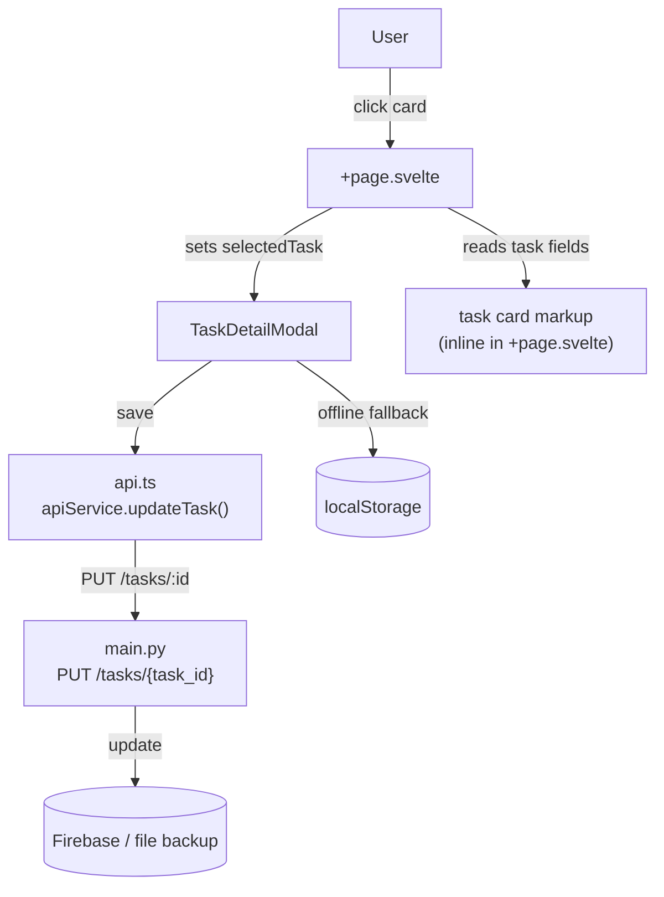

# Design Document: Task Details

## Overview

This feature extends the existing Kanban board with per-task detail editing. Clicking any task card opens a modal overlay where the user can read and edit a free-text description (up to 500 characters) and manage a list of assignees. Changes are saved through the existing FastAPI backend (or localStorage when offline) and visual indicators on the card surface reflect whether a task has details attached.

The implementation touches three layers:
- **Data model** — extend `Task` with `description` and `assignees` fields
- **Frontend** — a new `TaskDetailModal.svelte` component plus indicator markup inside the existing task card template
- **Backend** — extend `TaskUpdate` / `Task` Pydantic models and the `PUT /tasks/{id}` handler

---

## Architecture



State flows in one direction: `selectedTask` is a reactive variable in `+page.svelte`. The modal receives the task as a prop and emits a `save` event with the updated task. The parent updates the board state and persists it.

---

## Components and Interfaces

### TaskDetailModal.svelte

A new component at `src/lib/components/TaskDetailModal.svelte`.

**Props**
```ts
export let task: Task;          // the task being edited
export let open: boolean;       // controls visibility
```

**Events**
```ts
dispatch('save', updatedTask: Task)   // user clicked Save
dispatch('close')                     // user dismissed without saving
```

**Internal state**
```ts
let draftDescription: string   // copy of task.description for editing
let draftAssignees: string[]   // copy of task.assignees for editing
let assigneeInput: string      // current value of the add-assignee text field
let assigneeError: string      // inline duplicate/validation error
let saveError: string          // API error message
let saving: boolean            // loading state during API call
```

**Keyboard / backdrop handling**
- `svelte:window on:keydown` — close on Escape
- Backdrop `div` `on:click` — close on outside click
- Modal panel `on:click|stopPropagation` — prevent backdrop close when clicking inside

### +page.svelte changes

- Import `TaskDetailModal`
- Add reactive variable `let selectedTask: Task | null = null`
- Task card `on:click` sets `selectedTask = task` (with `stopPropagation` to block DnD)
- Handle `save` event: call `apiService.updateTask`, update board state, save to localStorage
- Handle `close` event: set `selectedTask = null`
- Add indicator markup inside `.task` for description icon and assignee badges

### api.ts changes

Extend existing interfaces:
```ts
export interface Task {
  id: number;
  text: string;
  column: string;
  userId?: string;
  description?: string;    // NEW
  assignees?: string[];    // NEW
}

export interface TaskUpdate {
  text?: string;
  column?: string;
  description?: string;   // NEW
  assignees?: string[];   // NEW
}
```

---

## Data Models

### Frontend (TypeScript)

```ts
interface Task {
  id: number;
  text: string;
  column: string;
  userId?: string;
  description?: string;   // max 500 chars; absent means no description
  assignees?: string[];   // ordered list of display names / emails
}
```

### Backend (Python / Pydantic)

```python
class Task(BaseModel):
    id: int
    text: str
    column: str
    userId: Optional[str] = None
    description: Optional[str] = None   # NEW
    assignees: Optional[List[str]] = []  # NEW

class TaskUpdate(BaseModel):
    text: Optional[str] = None
    column: Optional[str] = None
    description: Optional[str] = None   # NEW
    assignees: Optional[List[str]] = None  # NEW
```

The `PUT /tasks/{task_id}` handler is extended to apply `description` and `assignees` when present in the request body, mirroring the existing `text` / `column` update pattern.

### Storage

Firebase Firestore documents gain two optional fields: `description` (string) and `assignees` (array of strings). Existing documents without these fields are treated as having `description = ""` and `assignees = []` — no migration required.

localStorage entries are JSON-serialised `Task[]` objects; the new fields are included automatically once the TypeScript interface is updated.

---

## Correctness Properties

*A property is a characteristic or behavior that should hold true across all valid executions of a system — essentially, a formal statement about what the system should do. Properties serve as the bridge between human-readable specifications and machine-verifiable correctness guarantees.*

### Property 1: Clicking a task opens the modal for that task

*For any* task on the board, clicking its card should set `selectedTask` to exactly that task object, making the modal visible for that task and no other.

**Validates: Requirements 1.1**

---

### Property 2: Modal displays task data

*For any* task with arbitrary text, description, and assignees, when the modal is opened for that task the rendered modal should contain the task's text, the task's description (or an empty textarea if absent), and each entry in the task's assignee list.

**Validates: Requirements 1.2, 2.1, 3.1**

---

### Property 3: Close discards draft

*For any* open modal state with unsaved draft changes to description or assignees, closing the modal (via Escape key or backdrop click) should leave the underlying task object unchanged and reset the draft state.

**Validates: Requirements 1.4, 1.5**

---

### Property 4: Description length constraint

*For any* string of length greater than 500 characters, the modal should not allow it to be saved as a description — the saved description length must always be ≤ 500 characters.

**Validates: Requirements 2.2, 2.3**

---

### Property 5: Save round-trip

*For any* task with a valid description (≤ 500 chars) and a valid assignee list, saving the task details and then loading the task from storage should return a task whose description and assignees are equal to what was saved.

**Validates: Requirements 2.4, 3.6, 4.1**

---

### Property 6: Task card indicators reflect task data

*For any* task, the card's indicator area should display a description icon if and only if the task has a non-empty description, and should display assignee badges if and only if the task has at least one assignee. When both fields are absent the indicator area should be empty.

**Validates: Requirements 2.5, 3.7, 5.1, 5.2, 5.3**

---

### Property 7: Add assignee grows list

*For any* assignee list and any non-empty, non-duplicate assignee string, adding that string should result in the list growing by exactly one and the new entry being present at the end.

**Validates: Requirements 3.2**

---

### Property 8: Duplicate assignee rejected

*For any* assignee list and any string already present in that list, attempting to add it again should leave the list length unchanged and the list contents identical to before.

**Validates: Requirements 3.3**

---

### Property 9: Remove assignee shrinks list

*For any* assignee list and any assignee present in that list, removing that assignee should result in the list no longer containing that entry and the list length decreasing by exactly one.

**Validates: Requirements 3.5**

---

### Property 10: API accepts optional detail fields

*For any* task update payload where `description` and `assignees` are present, the API should return a 200 response whose body reflects the submitted values — and for any payload where those fields are absent, the existing values should be preserved.

**Validates: Requirements 4.4, 4.1**

---

## Error Handling

| Scenario | Behaviour |
|---|---|
| API save fails (network / 5xx) | Modal shows inline error banner; draft values are retained so the user can retry |
| API offline at save time | Falls back to localStorage; board shows "Offline Mode" indicator (already present) |
| Description > 500 chars | `maxlength` attribute on textarea prevents input; character counter shown |
| Duplicate assignee | Inline error below assignee input; list unchanged |
| Empty assignee submit | Silently ignored; no error shown |
| Task not found (404 on PUT) | Modal shows error message; draft retained |

---

## Testing Strategy

### Unit tests

Focus on pure logic functions that can be tested without a DOM:

- `addAssignee(list, value)` — returns new list or error for duplicates/empty
- `removeAssignee(list, index)` — returns new list without the entry
- `validateDescription(text)` — returns true for ≤ 500 chars, false otherwise
- API service `updateTask` — mock fetch, verify request body includes `description` and `assignees`
- Backend `PUT /tasks/{id}` — use FastAPI `TestClient` to verify description/assignees are persisted and returned

### Property-based tests

Use **fast-check** (TypeScript/frontend) and **Hypothesis** (Python/backend).

Each property test runs a minimum of **100 iterations**.

Tag format: `// Feature: task-details, Property N: <property text>`

| Property | Test description | Library |
|---|---|---|
| P1: Click opens modal | For any task, clicking sets selectedTask to that task | fast-check |
| P2: Modal displays task data | For any Task, rendered modal contains text/description/assignees | fast-check |
| P3: Close discards draft | For any draft state, Escape/backdrop click leaves task unchanged | fast-check |
| P4: Description length constraint | For any string len > 500, saved description len ≤ 500 | fast-check |
| P5: Save round-trip | For any valid task details, save then load returns same values | fast-check + Hypothesis |
| P6: Card indicators | For any task, indicator presence ↔ non-empty description/assignees | fast-check |
| P7: Add assignee grows list | For any list + valid new entry, list grows by 1 | fast-check |
| P8: Duplicate rejected | For any list + existing entry, list unchanged after add attempt | fast-check |
| P9: Remove shrinks list | For any list + present entry, list shrinks by 1 after remove | fast-check |
| P10: API optional fields | For any update payload, API preserves or updates description/assignees correctly | Hypothesis |

Property tests live in:
- `src/lib/__tests__/taskDetails.property.test.ts` (frontend, Vitest + fast-check)
- `backend/test_task_details_properties.py` (backend, pytest + Hypothesis)
